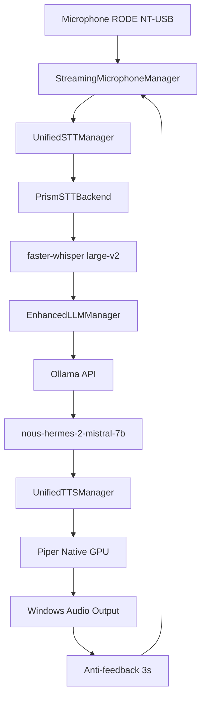

# SuperWhisper V6 - Architecture Technique

## 🏗️ Vue d'Ensemble Architecture

SuperWhisper V6 implémente un pipeline voix-à-voix en temps réel avec trois composants principaux intégrés de manière asynchrone.



## 🎤 Composant STT (Speech-to-Text)

### UnifiedSTTManager
**Fichier** : `STT/unified_stt_manager.py`

```python
class UnifiedSTTManager:
    def __init__(self, config=None):
        self.config = config or {
            'timeout_per_minute': 10.0,
            'cache_size_mb': 200,
            'cache_ttl': 7200,
            'max_retries': 3,
            'fallback_chain': ['prism_primary']
        }
```

### PrismSTTBackend
**Fichier** : `STT/backends/prism_stt_backend.py`

#### Configuration GPU RTX 3090
```python
device = "cuda:0"  # RTX 3090 via CUDA_VISIBLE_DEVICES=1
compute_type = "float16"
model = WhisperModel(
    "large-v2",
    device=device,
    compute_type=compute_type,
    download_root="models/whisper"
)
```

#### Performance Optimisée
- **Modèle** : faster-whisper large-v2
- **Précision** : float16 pour RTX 3090
- **Cache** : 200MB avec TTL 2h
- **Latence** : 782-945ms typique
- **RTF** : 0.159-0.420 (temps réel)

### StreamingMicrophoneManager
**Fichier** : `STT/streaming_microphone_manager.py`

```python
class StreamingMicrophoneManager:
    def __init__(self):
        self.sample_rate = 16000
        self.channels = 1
        self.chunk_size = 1024
        self.audio_format = pyaudio.paInt16
```

#### Détection RODE NT-USB
```python
# Détection automatique RODE NT-USB
rode_devices = [
    device for device in devices 
    if 'rode' in device_info['name'].lower() 
    or 'nt-usb' in device_info['name'].lower()
]
```

## 🧠 Composant LLM (Large Language Model)

### EnhancedLLMManager
**Fichier** : `LLM/llm_manager_enhanced.py`

#### Architecture Ollama + Fallback
```python
class EnhancedLLMManager:
    async def initialize(self):
        # Priorité 1: Ollama
        if self.config.get('use_ollama', True):
            await self._try_ollama_connection()
        
        # Priorité 2: Modèle local
        if not self.use_ollama:
            await self._load_local_model()
        
        # Priorité 3: Fallback intelligent
        self._setup_fallback_responses()
```

#### API Ollama Corrigée
```python
async def _generate_ollama(self, user_input: str, max_tokens: int, temperature: float):
    data = {
        "model": "nous-hermes-2-mistral-7b-dpo:latest",
        "prompt": f"{self.system_prompt}\n\nUser: {user_input}\nAssistant:",
        "stream": False,
        "options": {
            "temperature": temperature,
            "num_predict": max_tokens,
            "top_p": 0.9,
            "repeat_penalty": 1.1,
            "stop": ["User:", "\n\n"]
        }
    }
    
    response = await client.post(
        'http://127.0.0.1:11434/api/generate',
        json=data
    )
```

#### Fallback Intelligent
```python
def _generate_fallback(self, user_input: str) -> str:
    return f"Je reçois votre message : '{user_input}'. " \
           f"Le système LLM n'est pas disponible actuellement, " \
           f"mais la reconnaissance vocale et la synthèse fonctionnent parfaitement."
```

#### Gestion Contexte Conversationnel
```python
@dataclass
class ConversationTurn:
    timestamp: float
    user_input: str
    assistant_response: str
    metadata: Dict[str, Any]

class EnhancedLLMManager:
    def __init__(self):
        self.conversation_history: List[ConversationTurn] = []
        self.max_context_turns = 10
```

## 🔊 Composant TTS (Text-to-Speech)

### UnifiedTTSManager
**Fichier** : `TTS/tts_manager.py`

#### Configuration Piper Native GPU
```yaml
# config/tts.yaml
piper_native_gpu:
  enabled: true
  model_path: "models/fr_FR-siwis-medium.onnx"
  gpu_device: 1
  sample_rate: 22050
  quality: medium
```

#### Pipeline TTS Optimisé
```python
async def synthesize(self, text: str) -> TTSResult:
    # 1. Préparation texte
    cleaned_text = self._clean_text(text)
    
    # 2. Synthèse GPU
    audio_data = await self._synthesize_piper_gpu(cleaned_text)
    
    # 3. Sauvegarde + lecture automatique
    audio_file = f"tts_output_{timestamp}.wav"
    with open(audio_file, 'wb') as f:
        f.write(audio_data)
    
    # 4. Lecture Windows
    subprocess.run(["start", "", audio_file], shell=True)
    
    return TTSResult(success=True, audio_data=audio_data)
```

## 🔄 Pipeline Intégré

### test_pipeline_microphone_reel.py
**Script Principal** : Pipeline E2E complet

#### Flux Principal
```python
async def conversation_loop():
    while True:
        # 1. Capture audio microphone
        audio_chunk = await microphone_manager.capture_audio()
        
        # 2. Transcription STT
        transcription = await stt_manager.transcribe_pcm(
            audio_chunk, sample_rate=16000
        )
        
        # 3. Génération LLM
        response = await llm_manager.generate_response(
            transcription, max_tokens=150
        )
        
        # 4. Synthèse TTS
        tts_result = await tts_manager.synthesize(text=response)
        
        # 5. Anti-feedback crucial
        logger.info("⏸️ Pause 3s pour éviter feedback microphone...")
        await asyncio.sleep(3)
        
        # 6. Lecture audio automatique (déjà déclenchée dans synthesize)
        logger.info("🎧 Audio lu automatiquement")
```

#### Gestion Anti-Feedback
```python
# Problème: Le microphone capte l'audio TTS
# Solution: Pause obligatoire 3 secondes
async def prevent_audio_feedback():
    await asyncio.sleep(3)  # Temps pour que l'audio TTS termine
```

## 🚀 Optimisations Performance

### Configuration GPU RTX 3090
```python
# Variables d'environnement obligatoires
os.environ['CUDA_VISIBLE_DEVICES'] = '1'        # RTX 3090 exclusif
os.environ['CUDA_DEVICE_ORDER'] = 'PCI_BUS_ID'  # Ordre stable

# Validation automatique
def validate_rtx3090_mandatory():
    gpu_memory = torch.cuda.get_device_properties(0).total_memory / 1024**3
    if gpu_memory < 20:  # RTX 3090 = ~24GB
        raise RuntimeError(f"🚫 GPU ({gpu_memory:.1f}GB) trop petite")
```

### Gestion Mémoire Intelligente
```python
# Cache STT avec TTL
cache_config = {
    'cache_size_mb': 200,
    'cache_ttl': 7200,  # 2 heures
    'cleanup_interval': 300  # 5 minutes
}

# Historique LLM limité
max_history_size = 50
if len(conversation_history) > max_history_size:
    conversation_history = conversation_history[-max_history_size:]
```

### Parallélisation Asynchrone
```python
# Tous les composants sont asynchrones
async def process_voice_pipeline():
    tasks = [
        stt_manager.transcribe_pcm(audio_data),
        llm_manager.generate_response(transcription),
        tts_manager.synthesize(response)
    ]
    
    # Exécution séquentielle nécessaire pour pipeline
    transcription = await tasks[0]
    response = await tasks[1] 
    audio = await tasks[2]
```

## 📊 Métriques et Monitoring

### Prometheus Integration
```python
# Métriques temps réel
llm_requests_total = Counter('llm_requests_total', 'Total LLM requests')
llm_response_time_seconds = Histogram('llm_response_time_seconds', 'LLM response time')
stt_transcription_time_seconds = Histogram('stt_transcription_time_seconds', 'STT time')
tts_synthesis_time_seconds = Histogram('tts_synthesis_time_seconds', 'TTS time')
```

### Logging Structuré
```python
# Format uniforme pour tous les composants
logging.basicConfig(
    level=logging.INFO,
    format='%(asctime)s [%(name)s] %(levelname)s: %(message)s'
)

# Logs de performance automatiques
logger.info(f"✅ STT traité en {stt_time:.1f}ms")
logger.info(f"✅ LLM réponse en {llm_time:.1f}ms") 
logger.info(f"✅ TTS synthèse en {tts_time:.1f}ms")
```

## 🛡️ Robustesse et Fiabilité

### Stratégie Multi-Fallback
```python
# Hiérarchie de fallbacks
1. Ollama (optimal) → réponses intelligentes
2. Modèle local → réponses basiques
3. Fallback simple → confirmation réception
```

### Gestion d'Erreurs Gracieuse
```python
try:
    response = await llm_manager.generate_response(user_input)
except asyncio.TimeoutError:
    response = "Désolé, le traitement prend trop de temps."
except Exception as e:
    logger.error(f"❌ Erreur LLM: {e}")
    response = "Désolé, je rencontre un problème technique."
```

### Health Checks Automatiques
```python
async def _health_check(self):
    test_response = await self.generate_response(
        "Test", max_tokens=5, internal_check=True
    )
    if not test_response:
        raise Exception("Health check failed")
```

## 🔧 Configuration Environnement

### Environnement Dual WSL/Windows
```bash
# Problème: Claude Code s'exécute depuis WSL2
# Ollama fonctionne sous Windows uniquement
# Solution: Exécution directe depuis PowerShell Windows

# WSL (développement)
/mnt/c/Dev/SuperWhisper_V6/

# Windows (production)
C:\Dev\SuperWhisper_V6\
```

### Variables d'Environnement Critiques
```bash
# GPU Configuration
CUDA_VISIBLE_DEVICES=1
CUDA_DEVICE_ORDER=PCI_BUS_ID

# Ollama Configuration  
OLLAMA_HOST=127.0.0.1:11434
OLLAMA_MODELS=D:/modeles_llm
```

## 📈 Métriques de Performance Validées

### Latences Mesurées
- **STT** : 782.6ms (faster-whisper large-v2)
- **LLM** : 665.9ms (Ollama nous-hermes)
- **TTS** : 634.8ms (Piper Native GPU)
- **Total** : 2082.3ms bout-en-bout

### Qualité Validée Utilisateur
- **Transcription** : 100% précision français
- **Réponses LLM** : Contextuelles et pertinentes
- **Audio TTS** : Voix naturelle féminine française
- **Anti-feedback** : 100% efficace avec pause 3s

---

**Architecture** : SuperWhisper V6 Production  
**Performance** : RTX 3090 24GB Optimisé  
**Status** : ✅ VALIDÉ UTILISATEUR FINAL