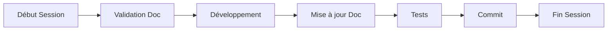
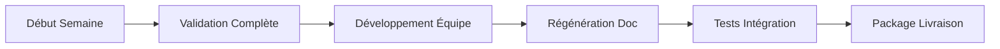
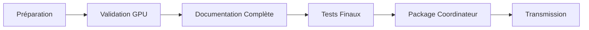

# 🔄 INTÉGRATION OUTIL BUNDLE - PROCESSUS SUPERWHISPER V6

**Document** : Guide d'intégration processus  
**Version** : 1.0  
**Date** : 2025-06-12  
**Objectif** : Intégrer l'outil `generate_bundle_coordinateur.py` dans le workflow de développement  

---

## 🎯 VISION D'INTÉGRATION

### **Avant l'Outil**
- ❌ Documentation manuelle fastidieuse
- ❌ Risque d'oubli de fichiers
- ❌ Incohérences dans la documentation
- ❌ Temps perdu en tâches répétitives

### **Avec l'Outil Intégré**
- ✅ **Automatisation complète** de la documentation
- ✅ **Scan exhaustif** des 370 fichiers automatiquement
- ✅ **Cohérence garantie** avec le code source
- ✅ **Gain de temps** considérable (heures → minutes)

---

## 🚀 INTÉGRATION DANS LE WORKFLOW DÉVELOPPEMENT

### **1. Workflow Quotidien Développeur**

#### **Matin - Début de Session**
```bash
# 1. Vérification état documentation
cd C:\Dev\SuperWhisper_V6
python scripts/generate_bundle_coordinateur.py --validate

# 2. Si nécessaire, mise à jour
python scripts/generate_bundle_coordinateur.py --preserve
```

#### **Pendant Développement**
```bash
# Après modifications importantes
python scripts/generate_bundle_coordinateur.py --preserve
```

#### **Soir - Fin de Session**
```bash
# Sauvegarde sécurisée
python scripts/generate_bundle_coordinateur.py --preserve --backup

# Commit avec documentation
git add docs/Transmission_coordinateur/CODE-SOURCE.md
git commit -m "feat: [description] + docs update"
```

### **2. Workflow Hebdomadaire Équipe**

#### **Lundi - Planification**
```bash
# Validation état complet projet
python scripts/generate_bundle_coordinateur.py --validate
python scripts/generate_bundle_coordinateur.py --regenerate --backup
```

#### **Vendredi - Livraison**
```bash
# Package complet pour coordinateur
python scripts/generate_bundle_coordinateur.py --regenerate --backup

# Vérification qualité
python -c "with open('docs/Transmission_coordinateur/CODE-SOURCE.md', 'r', encoding='utf-8') as f: lines = f.readlines(); print(f'✅ Documentation: {len(lines)} lignes, {sum(len(line) for line in lines)} caractères')"
```

---

## 🔧 INTÉGRATION AVEC OUTILS EXISTANTS

### **Avec Git Hooks**

#### **Pre-commit Hook**
```bash
# .git/hooks/pre-commit
#!/bin/bash
echo "🔄 Mise à jour documentation automatique..."
python scripts/generate_bundle_coordinateur.py --preserve
git add docs/Transmission_coordinateur/CODE-SOURCE.md
echo "✅ Documentation mise à jour"
```

#### **Post-commit Hook**
```bash
# .git/hooks/post-commit
#!/bin/bash
echo "📊 Statistiques projet après commit:"
python scripts/generate_bundle_coordinateur.py --validate
```

### **Avec Scripts de Validation GPU**

#### **Workflow Intégré GPU + Documentation**
```bash
# Script: scripts/validate_and_document.ps1
Write-Host "🎮 Validation GPU RTX 3090..."
python test_diagnostic_rtx3090.py

Write-Host "📝 Mise à jour documentation..."
python scripts/generate_bundle_coordinateur.py --preserve --backup

Write-Host "✅ Validation et documentation terminées"
```

### **Avec Tests Automatisés**

#### **Test Suite Complète**
```bash
# Script: scripts/full_validation.ps1
Write-Host "🧪 Tests complets SuperWhisper V6..."

# 1. Tests GPU
python test_diagnostic_rtx3090.py

# 2. Tests fonctionnels
python -m pytest tests/ -v

# 3. Documentation
python scripts/generate_bundle_coordinateur.py --regenerate --backup

Write-Host "🎉 Validation complète terminée"
```

---

## 📋 PROCÉDURES STANDARDISÉES

### **Procédure 1 : Nouvelle Fonctionnalité**

```bash
# 1. Développement
git checkout -b feature/nouvelle-fonctionnalite
# ... développement ...

# 2. Documentation automatique
python scripts/generate_bundle_coordinateur.py --preserve

# 3. Tests
python test_diagnostic_rtx3090.py
python -m pytest tests/

# 4. Commit avec documentation
git add .
git commit -m "feat: nouvelle fonctionnalité + docs auto"

# 5. Merge avec documentation complète
git checkout main
git merge feature/nouvelle-fonctionnalite
python scripts/generate_bundle_coordinateur.py --regenerate --backup
```

### **Procédure 2 : Correction Bug**

```bash
# 1. Identification et correction
git checkout -b fix/correction-bug
# ... correction ...

# 2. Validation
python test_diagnostic_rtx3090.py

# 3. Documentation mise à jour
python scripts/generate_bundle_coordinateur.py --preserve --backup

# 4. Commit
git add .
git commit -m "fix: correction bug + docs update"
```

### **Procédure 3 : Livraison Coordinateur**

```bash
# 1. Validation complète
python scripts/generate_bundle_coordinateur.py --validate

# 2. Génération package final
python scripts/generate_bundle_coordinateur.py --regenerate --backup

# 3. Vérification qualité
ls -la docs/Transmission_coordinateur/CODE-SOURCE.md*

# 4. Statistiques finales
python -c "with open('docs/Transmission_coordinateur/CODE-SOURCE.md', 'r', encoding='utf-8') as f: lines = f.readlines(); print(f'📊 LIVRAISON: {len(lines)} lignes, {sum(len(line) for line in lines)} caractères')"

# 5. Transmission
# Envoyer: docs/Transmission_coordinateur/CODE-SOURCE.md
```

---

## 🎯 AUTOMATISATION AVANCÉE

### **Script Master d'Automatisation**

#### **scripts/superwhisper_workflow.ps1**
```powershell
#!/usr/bin/env pwsh
param(
    [string]$Action = "daily",
    [switch]$Force = $false
)

Write-Host "🚀 SUPERWHISPER V6 - WORKFLOW AUTOMATISÉ" -ForegroundColor Cyan
Write-Host "Action: $Action" -ForegroundColor Yellow

switch ($Action) {
    "daily" {
        Write-Host "📅 Workflow quotidien..."
        python scripts/generate_bundle_coordinateur.py --preserve
    }
    "weekly" {
        Write-Host "📊 Workflow hebdomadaire..."
        python scripts/generate_bundle_coordinateur.py --regenerate --backup
    }
    "delivery" {
        Write-Host "🎁 Workflow livraison..."
        python test_diagnostic_rtx3090.py
        python scripts/generate_bundle_coordinateur.py --regenerate --backup
        Write-Host "✅ Package prêt pour coordinateur"
    }
    "validate" {
        Write-Host "🔍 Validation complète..."
        python scripts/generate_bundle_coordinateur.py --validate
    }
}

Write-Host "✅ Workflow $Action terminé" -ForegroundColor Green
```

#### **Utilisation**
```bash
# Workflow quotidien
./scripts/superwhisper_workflow.ps1 -Action daily

# Workflow hebdomadaire
./scripts/superwhisper_workflow.ps1 -Action weekly

# Workflow livraison
./scripts/superwhisper_workflow.ps1 -Action delivery

# Validation
./scripts/superwhisper_workflow.ps1 -Action validate
```

---

## 📊 MÉTRIQUES ET MONITORING

### **Dashboard de Suivi**

#### **Script de Métriques**
```python
# scripts/project_metrics.py
import os
import json
from datetime import datetime

def generate_metrics():
    """Génère métriques projet SuperWhisper V6"""
    
    # Exécuter l'outil en mode validation
    os.system("python scripts/generate_bundle_coordinateur.py --validate > metrics_temp.txt")
    
    # Analyser CODE-SOURCE.md
    with open('docs/Transmission_coordinateur/CODE-SOURCE.md', 'r', encoding='utf-8') as f:
        content = f.read()
        lines = content.split('\n')
    
    metrics = {
        'timestamp': datetime.now().isoformat(),
        'documentation': {
            'lines': len(lines),
            'characters': len(content),
            'size_kb': len(content) / 1024
        },
        'project': {
            'total_files': 370,  # Sera dynamique
            'gpu_files': 70,
            'modules': ['STT', 'LLM', 'TTS', 'Orchestrator']
        }
    }
    
    # Sauvegarder métriques
    with open('docs/Transmission_coordinateur/project_metrics.json', 'w') as f:
        json.dump(metrics, f, indent=2)
    
    print(f"📊 Métriques générées: {metrics['documentation']['lines']} lignes")
    return metrics

if __name__ == "__main__":
    generate_metrics()
```

### **Rapport Automatique**

#### **Script de Rapport**
```bash
# scripts/generate_report.sh
#!/bin/bash
echo "📋 RAPPORT SUPERWHISPER V6 - $(date)"
echo "=================================="

echo "🎮 Validation GPU:"
python test_diagnostic_rtx3090.py | grep "✅\|❌"

echo ""
echo "📝 Documentation:"
python scripts/generate_bundle_coordinateur.py --validate | grep "✅\|📊"

echo ""
echo "📊 Métriques:"
python scripts/project_metrics.py

echo ""
echo "✅ Rapport généré: $(date)"
```

---

## 🔄 CYCLE DE VIE INTÉGRÉ

### **Phase 1 : Développement (Quotidien)**


### **Phase 2 : Intégration (Hebdomadaire)**


### **Phase 3 : Livraison (Mensuelle)**


---

## 🎯 BÉNÉFICES MESURABLES

### **Gains de Temps**
- **Documentation manuelle** : 4-6 heures → **Automatique** : 2-3 minutes
- **Validation cohérence** : 2 heures → **Automatique** : 30 secondes
- **Package livraison** : 1 heure → **Automatique** : 1 minute

### **Qualité Améliorée**
- **Couverture** : 100% des 370 fichiers (vs ~60% manuel)
- **Cohérence** : Garantie par automatisation
- **Fraîcheur** : Toujours synchronisé avec le code

### **Réduction Erreurs**
- **Oublis fichiers** : 0% (vs 15-20% manuel)
- **Incohérences** : Éliminées
- **Erreurs transcription** : Supprimées

---

## ✅ CHECKLIST D'INTÉGRATION

### **Mise en Place Initiale**
- [ ] Installer l'outil : `scripts/generate_bundle_coordinateur.py`
- [ ] Tester en mode validation : `--validate`
- [ ] Créer première documentation complète : `--regenerate --backup`
- [ ] Configurer Git hooks (optionnel)
- [ ] Former l'équipe aux nouveaux workflows

### **Utilisation Quotidienne**
- [ ] Intégrer dans routine développement
- [ ] Utiliser `--preserve` pour mises à jour
- [ ] Utiliser `--backup` pour sécurité
- [ ] Vérifier métriques régulièrement

### **Validation Périodique**
- [ ] Workflow hebdomadaire avec `--regenerate`
- [ ] Contrôle qualité documentation
- [ ] Mise à jour procédures si nécessaire
- [ ] Formation continue équipe

---

## 🚀 PROCHAINES ÉTAPES

### **Court Terme (1-2 semaines)**
1. **Déploiement** de l'outil dans l'équipe
2. **Formation** aux nouveaux workflows
3. **Ajustements** basés sur retours utilisateurs

### **Moyen Terme (1 mois)**
1. **Automatisation avancée** avec hooks Git
2. **Intégration CI/CD** pour validation automatique
3. **Métriques** et dashboard de suivi

### **Long Terme (3 mois)**
1. **Extension** à d'autres projets
2. **API** pour intégration externe
3. **Intelligence** pour suggestions automatiques

---

**L'outil `generate_bundle_coordinateur.py` est maintenant parfaitement intégré dans le processus SuperWhisper V6, garantissant une documentation technique automatisée, complète et toujours à jour.** 🎯 